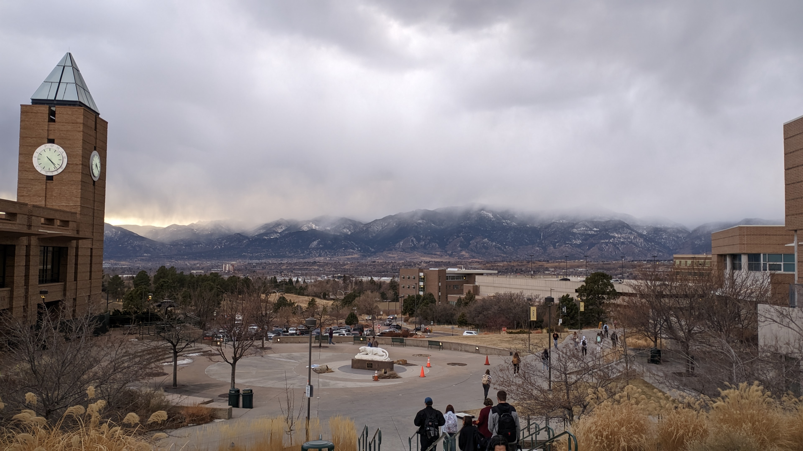
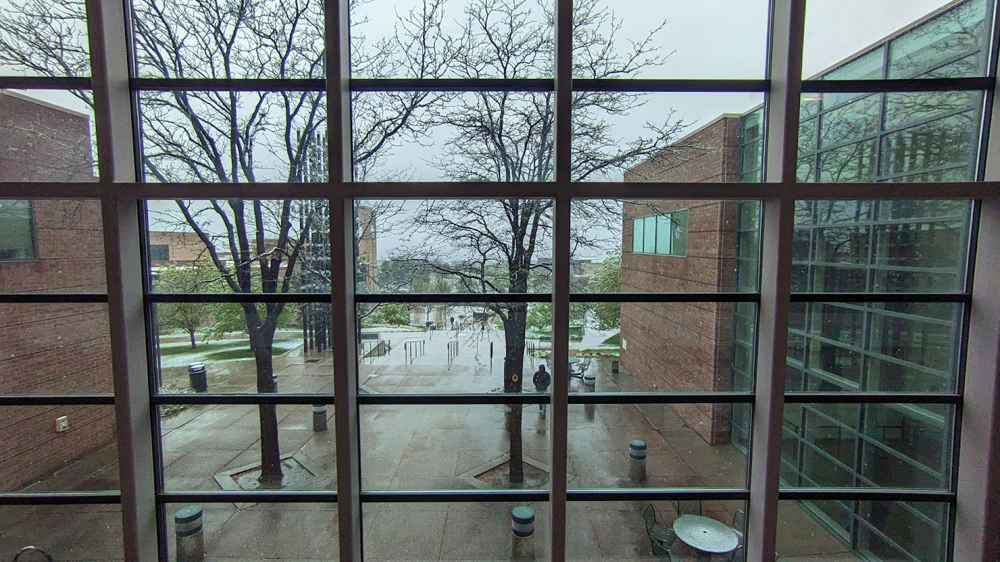
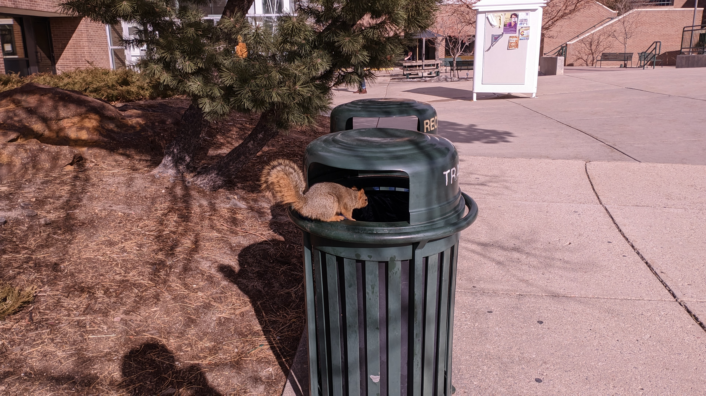
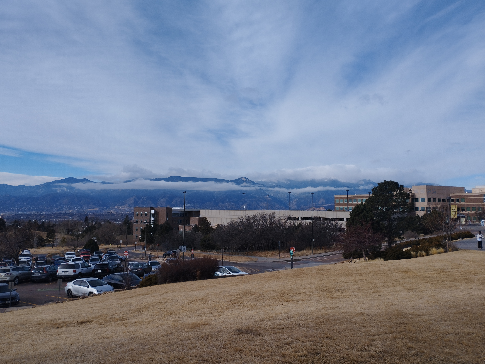
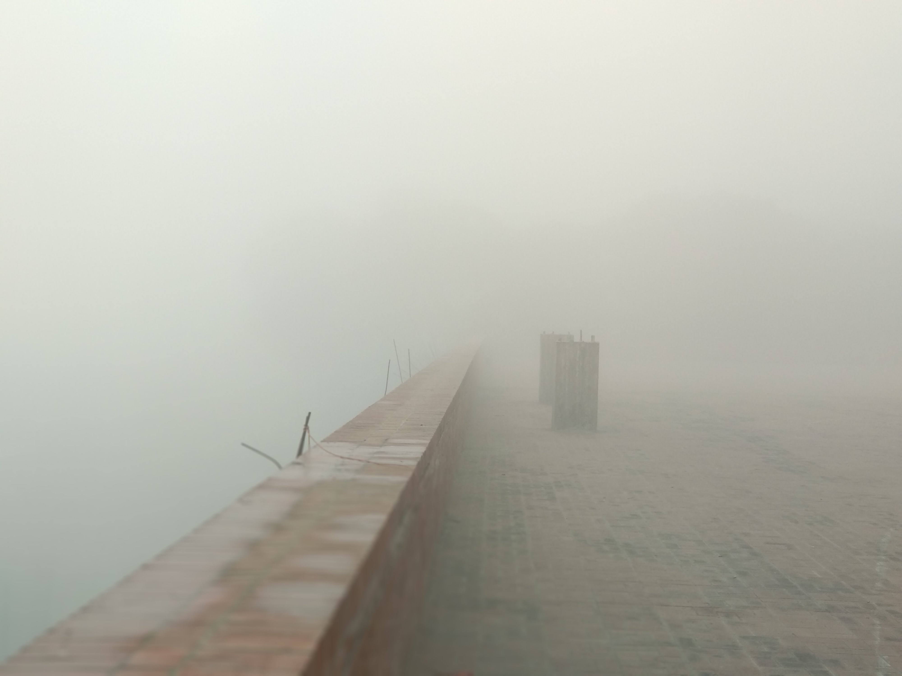
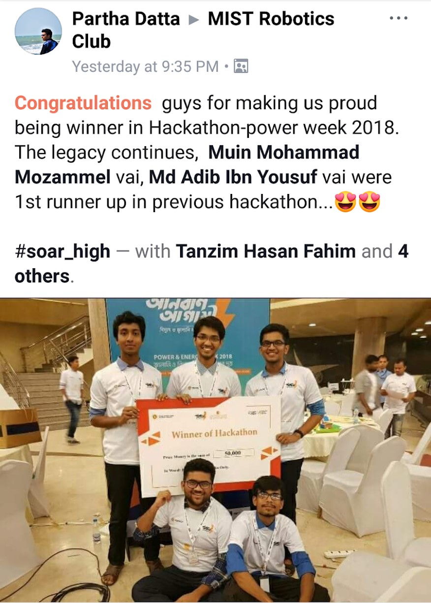
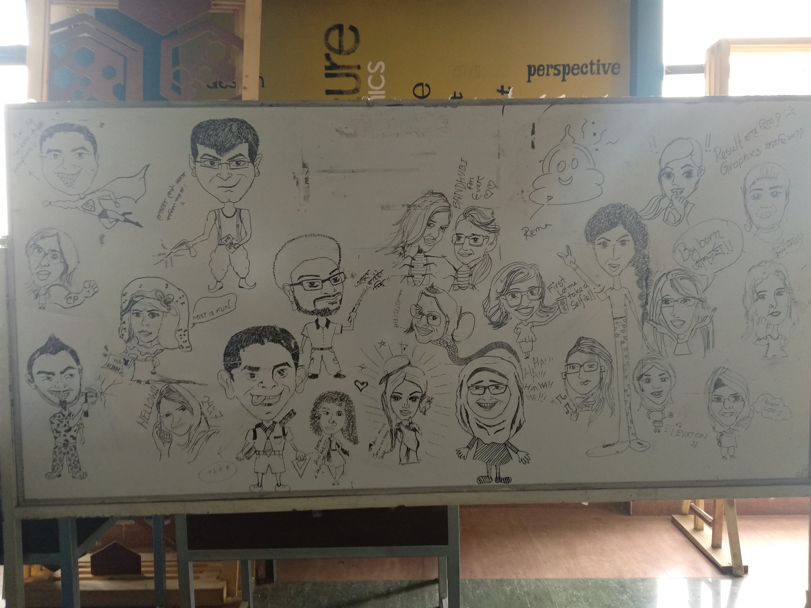
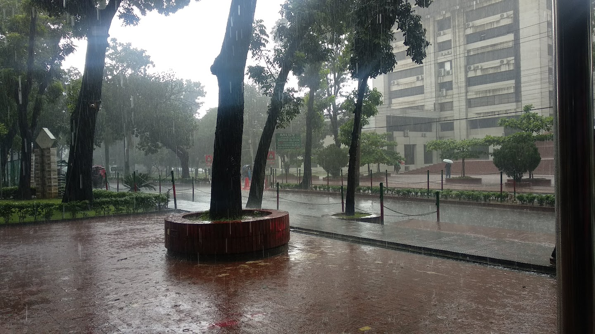
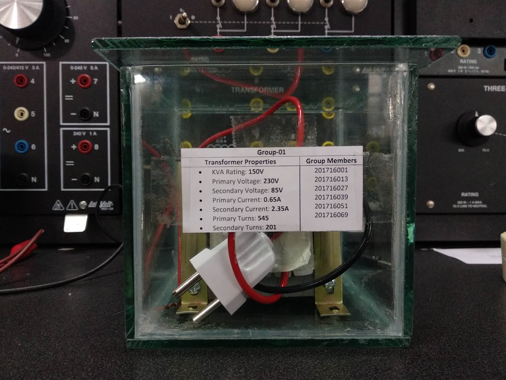

## My academic journey (so far)

- <b>University of Colorado Colorado Springs (UCCS)</b>: I'm finishing up my master's in CS.

    

        
        
    

    

        
        
    

- <b>Military Institute of Science & Technology (MIST)</b>:  I retained nothing noteworthy from it except for my robotics, microcontrollers, and hardware skills.

    

        
        
    

    

        
        
        
        
    

[Go to home]()