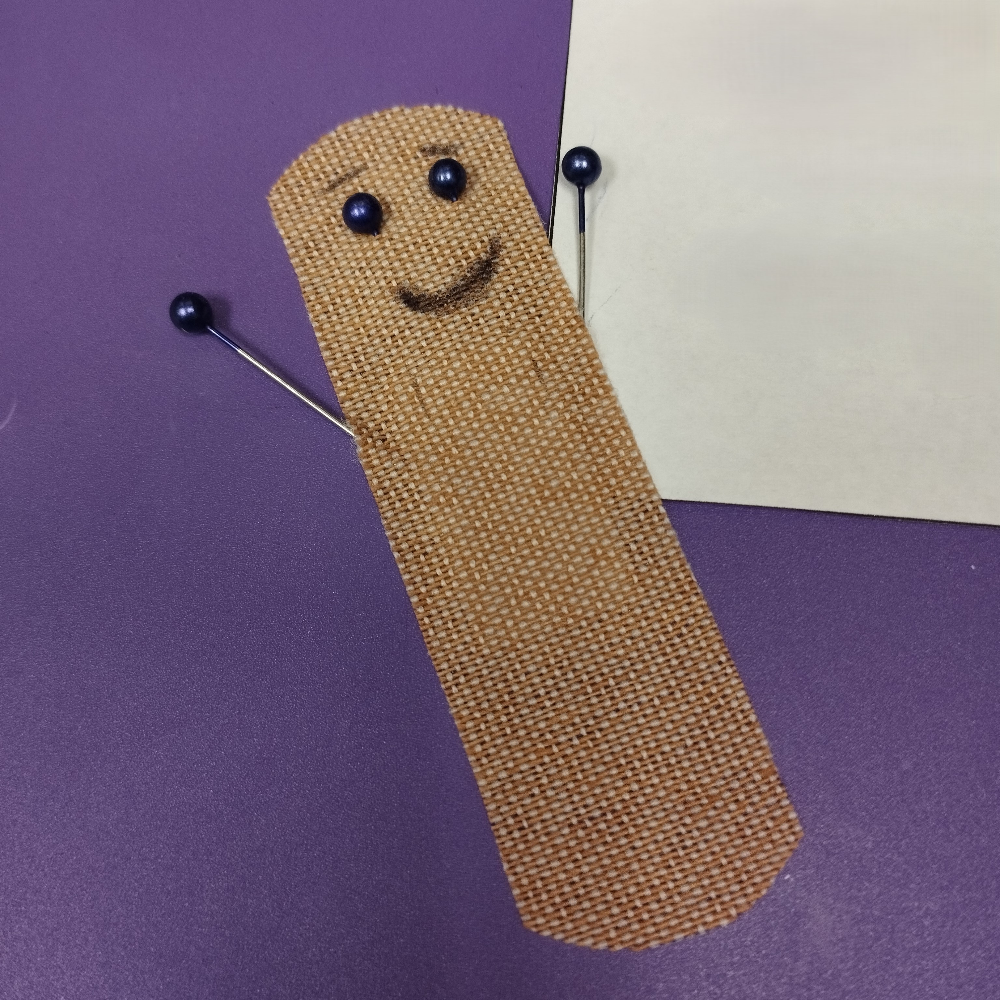

Hi there. I'm an MSCS student at the [University of Colorado Colorado Springs (UCCS)](https://www.uccs.edu/). I did my undergrad in Electrical Engineering. I retained nothing noteworthy from it except for my robotics, microcontrollers, and hardware skills.

[More about my education]()

I'm currently working with [Dr. Jugal Kalita](https://scholar.google.com/citations?user=dXITneMAAAAJ&hl=en) in the [Language Information and Computation (LINC) Lab](https://labs.uccs.edu/linclab/). I'm doing my thesis on Multi-Agent Reinforcement Learning (MARL) and working on a few other projects on Intrinsic Emotional Rewards, Multimodal Large Language Models, and Explainability (XAI). I am a Student Staff at the Computer Science Department and a Math Tutor at the PPSSC.

[More about my work history]()

I was a Graduate Research Assistant (GRA) in the [Quantum AI and Software (QAS) Lab](https://faculty.uccs.edu/amoin/research/) with [Dr. Armin Moin](https://scholar.google.com/citations?user=Pf1FmVYAAAAJ&hl=de) working on Quantum Machine Learning, Hybrid Quantum-Classical NLP, Energy-Efficient AI, and Software Engineering. I also worked with [Dr. Adham Atyabi](https://scholar.google.com/citations?user=Q-u5cCAAAAAJ&hl=en) at the NeuroCognition Laboratory (NCL) on Brain-Computer Interface (BCI) and Cognitive Workload Assessment.  

[More about my research]()

I love coding and research. I find joy in music, books, films, manga, video games, and gardening. I plan to start my PhD in Fall '26.

I'm always open to networking, collaborations, and discussing cool ideas. 

Feel free to [reach out to me]()

